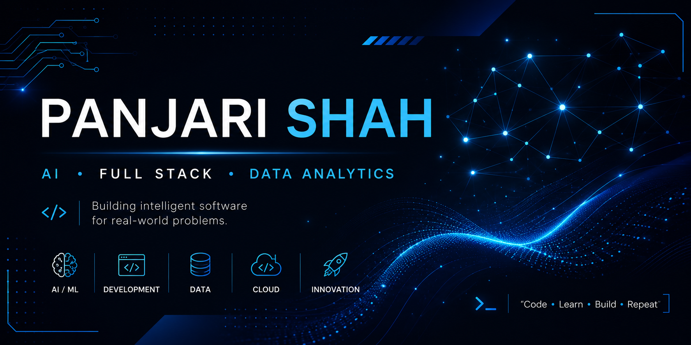

  

<h1 align="center">Hi 👋, I'm Panjari Shah</h1>

<h3 align="center">
AI & Machine Learning Enthusiast • Full-Stack Developer • Data Analytics Enthusiast
</h3>

---

# 👩‍💻 About Me

🎓 **B.Tech Computer Science & Engineering** @ NMIMS (2024–2028)

💡 Passionate about **Artificial Intelligence**, **Machine Learning**, **Data Analytics**, and **Full-Stack Development**.

🚀 I enjoy building intelligent software that solves real-world problems while continuously learning modern technologies.

🏆 **Achievements**
- 🥇 Google Hackathon Winner (2×)
- 🌍 Open Source Contributor (GirlScript Summer of Code)

💬 **Ask me about**
- Python
- SQL
- React
- FastAPI
- Machine Learning
- Data Analytics

📍 **Based in India 🇮🇳**

⚡ **Fun Fact**

> I believe every project teaches something new.

 

---

# 🚀 Currently Working On

- 🤖 Deep Learning & Generative AI
- 🌐 Full-Stack Web Applications
- ⚡ FastAPI & Backend Development
- 📊 Data Analytics Dashboards
- 🌍 Open Source Contributions (GSSoC)

 

---

# 🛠 Tech Stack

### 💻 Languages

### 🎨 Frontend

### ⚙️ Backend

### 🗄 Databases

### 🤖 AI / ML

### ☁️ Tools

 

---

# 📊 GitHub Statistics

 

---

# 🔥 GitHub Streak

 

---

# 📈 Contribution Graph

 

---

# 🏆 GitHub Trophies

 

---

# 🎯 2026 Goals

- 🚀 Build impactful AI & Full-Stack projects
- 🌍 Contribute consistently to Open Source
- ☁️ Learn Cloud Deployment & DevOps
- 📈 Strengthen Data Structures & Algorithms
- 💼 Secure a Software Engineering / AI Internship

 

---

# 🤝 Open To

✨ Software Engineering Internships

✨ AI / Machine Learning Opportunities

✨ Data Analytics Projects

✨ Open Source Collaboration

✨ Hackathons & Technical Communities

 

---

# 💭 Developer Quote

 

---

# 🐍 Contribution Snake

> **Enable the GitHub Action later** to activate this animation.

 

---

# 📫 Let's Connect

I'm always open to collaborating on interesting projects, contributing to open source, and connecting with fellow developers.

⭐ If you like my work, consider following my journey!

---

